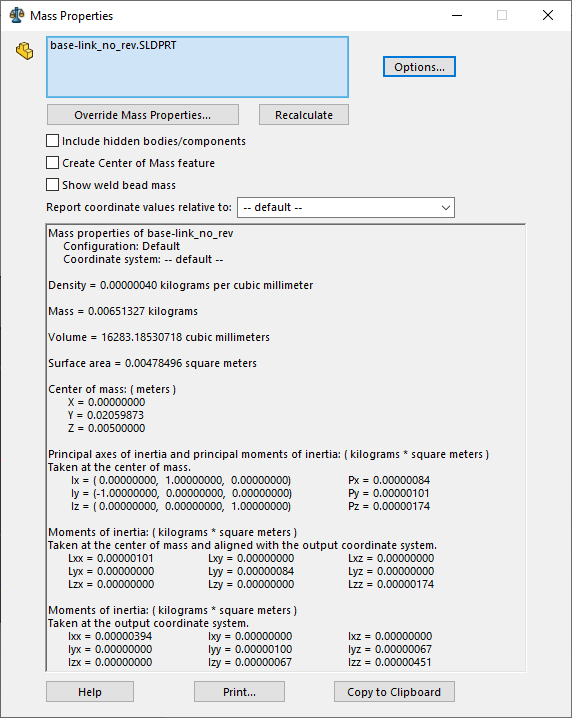
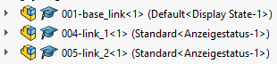
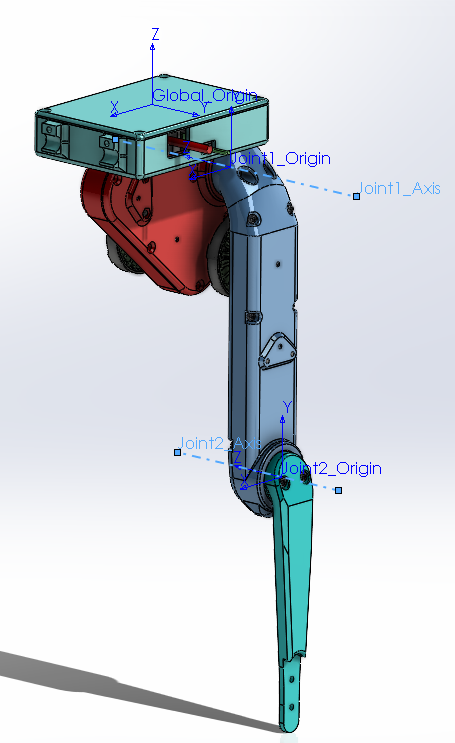
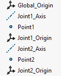
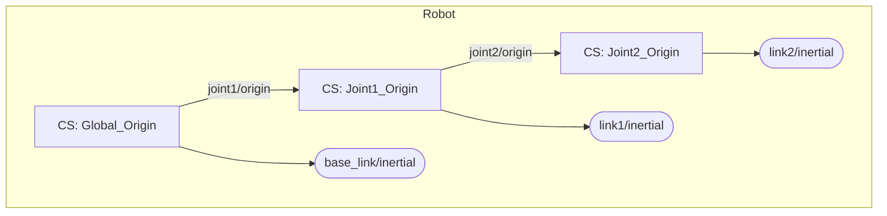

# URDF Creation

## 1 Masses & Inertia matrices in SolidWorks

This section contains a little bit of information about how Solidworks computes the mass properties of a part or an assembly.

To get a part's mass properties do: `Tools > Evaluate > Mass Properties`. You will see the following image:

<figure align="center">


<figcaption><b>Fig 1</b> Mass properties</figcaption>
</figure>

We have to select a the part to see its properties in the window. The selected part will appear in the top blue box. If we select an entire assembly (or multiple parts), the data will correspond as if all the parts form a single rigid body.

A good practice is to create a `Coordinate System` in the part and select it as a refernce in the dropdown list `Report coordinate values relative to:`.

The important fields in this image are the following:

- **Density**: Density of the part. Specified assigning a specific material to the part.
- **Mass**: Computed using the part's density and its volume.
- **Center of mass**: center of mass of the part. *Changes depending on the selected coordinate system.*
- **Moments of inertia, taken at the center of mass**: This is the inertia matrix at the center of mass of the part and aligned with the selected coordinate system. *Changes depending on the selected coordinate system.* **This matrix is the one used when exporting to a URDF**.
- **Moments of inertia, taken at the output coordinate system**: This is the inertia matrix at origin of the selected coordinate system and aligned with it.

> **INFO** :information_source: : The mass value can be overridden with the button placed at the top of the window `Override Mass Properties...` and the inertia matrices will be changed accordingly. :warning: **Please, note that the overridden mass is NOT considered when exporting to URDF**.

## 2 Exporting to URDF

To export an assembly to a URDF we have to first install this [SolidWorks plugin](https://wiki.ros.org/sw_urdf_exporter).

List of facts related to this Solidworks plugin:

- It does not consider user overridden mass
- Inertias and masses are computed using the material density and the part's volume
- If we want to set a specific mass for a specific object, we have to do it by creating a custom material with the required density
- Suppressed elements are not considered in the export tool.
- Hidden elements are not considered by the `Mass properties` tool

After this and before the exporting procedure, there are some good practices to consider:

### 2.1 Links as subassemblies

To better assign SW parts to each link, it is a good practice to put all parts corresponding to an individual link into a subassembly. See the following image.

<figure align="center">


<figcaption><b>Fig 2</b> Subassembly separation</figcaption>
</figure>

Thus, the main robot assembly is only composed by subassemblies, each one corresponding to a link.

### 2.2 Reference Geometry

The URDF tool exporter needs reference geometry to create the URDF. 
This geometry consists of an axis and a coordinate system for each joint.
Besides, it also needs a coordinate system representing the global origin.
Even though this geometry can be created automatically by the tool, we recommend to do it manually.

The reference geometry chosen for the 2-DOF arm is shown in Fig 3.
<figure align="center">
  
  

  <figcaption><b>Fig 3</b> Reference geometry objects. Notice that points are auxiliary geometry to place the center of each coordinate system.</figcaption>
</figure>

We must be sure that an axis of a joint's coordinate system coincides with the axis of rotation.
We have chosen to follow the Denavit-Hartenberg convention, which selects the z-axis to coincide with the joint's axis of rotation.
The `axis` objects are used by the URDF exported to know that the joint is of `revolute` type.

### 2.3 Creating the URDF
To create the URDF we do `Tools > Export as URDF`. 
After this, we proceed to create the robot's kinematic tree:

1. Choose the subassembly that constitutes the base link, the coordinate system that represents the global origin and the number of child links (1 in our case).
2. Configure the child links. For each child link you should do:
   1. Assign a name to the link.
   2. Assign a name to the joint that unites the previous link (parent) to the current link (child).
   3. Choose the reference coordinate system for the joint as well as its axis.
   4. Choose the joint type (revolute in our case).
   5. Choose the subassembly for the current link.
   6. Add number of child links.
3. When finished to add all the links in the tree, click `Preview and Export...`

If the SW assembly has been configured properly, we should be done by clicking `Next` until the end of the process, where it asks us for a folder to save the URDF.
### 2.4 Understanding the exported URDF

**URDF file:**

```xml
<?xml version="1.0" encoding="utf-8"?>
<!-- This URDF was automatically created by SolidWorks to URDF Exporter! Originally created by Stephen Brawner (brawner@gmail.com) 
     Commit Version: 1.6.0-1-g15f4949  Build Version: 1.6.7594.29634
     For more information, please see http://wiki.ros.org/sw_urdf_exporter -->
<robot
  name="urdf">
  <link
    name="base_link">
    <inertial>
      <origin
        xyz="-0.015484 -0.0099673 -0.039447"
        rpy="0 0 0" />
      <mass
        value="0.1603" />
      <inertia
        ixx="7.1642E-05"
        ixy="5.1444E-07"
        ixz="-5.3098E-06"
        iyy="0.0001433"
        iyz="-5.6096E-07"
        izz="0.00015608" />
    </inertial>
    <visual>
      <origin
        xyz="0 0 0"
        rpy="0 0 0" />
      <geometry>
        <mesh
          filename="package://hidro_arm_2dof_urdf/meshes/base_link.STL" />
      </geometry>
      <material
        name="">
        <color
          rgba="0.75294 0.75294 0.75294 1" />
      </material>
    </visual>
    <collision>
      <origin
        xyz="0 0 0"
        rpy="0 0 0" />
      <geometry>
        <mesh
          filename="package://hidro_arm_2dof_urdf/meshes/base_link.STL" />
      </geometry>
    </collision>
  </link>
  <link
    name="link1">
    <inertial>
      <origin
        xyz="2.4506E-05 -0.080142 -0.018964"
        rpy="0 0 0" />
      <mass
        value="0.094157" />
      <inertia
        ixx="0.00015435"
        ixy="-7.262E-08"
        ixz="-5.794E-09"
        iyy="1.4679E-05"
        iyz="-1.0071E-05"
        izz="0.00015963" />
    </inertial>
    <visual>
      <origin
        xyz="0 0 0"
        rpy="0 0 0" />
      <geometry>
        <mesh
          filename="package://hidro_arm_2dof_urdf/meshes/link1.STL" />
      </geometry>
      <material
        name="">
        <color
          rgba="0.75294 0.75294 0.75294 1" />
      </material>
    </visual>
    <collision>
      <origin
        xyz="0 0 0"
        rpy="0 0 0" />
      <geometry>
        <mesh
          filename="package://hidro_arm_2dof_urdf/meshes/link1.STL" />
      </geometry>
    </collision>
  </link>
  <joint
    name="joint1"
    type="revolute">
    <origin
      xyz="-0.064701 -0.001955 -0.04685"
      rpy="1.5708 0 0" />
    <parent
      link="base_link" />
    <child
      link="link1" />
    <axis
      xyz="0 0 -1" />
    <limit
      lower="0"
      upper="0"
      effort="0"
      velocity="0" />
  </joint>
  <link
    name="link2">
    <inertial>
      <origin
        xyz="-3.1859E-08 -0.039593 -0.0062602"
        rpy="0 0 0" />
      <mass
        value="0.027685" />
      <inertia
        ixx="3.3553E-05"
        ixy="3.1357E-11"
        ixz="9.2484E-13"
        iyy="1.2727E-06"
        iyz="-8.4475E-07"
        izz="3.4062E-05" />
    </inertial>
    <visual>
      <origin
        xyz="0 0 0"
        rpy="0 0 0" />
      <geometry>
        <mesh
          filename="package://hidro_arm_2dof_urdf/meshes/link2.STL" />
      </geometry>
      <material
        name="">
        <color
          rgba="0.75294 0.75294 0.75294 1" />
      </material>
    </visual>
    <collision>
      <origin
        xyz="0 0 0"
        rpy="0 0 0" />
      <geometry>
        <mesh
          filename="package://hidro_arm_2dof_urdf/meshes/link2.STL" />
      </geometry>
    </collision>
  </link>
  <joint
    name="joint2"
    type="revolute">
    <origin
      xyz="0 -0.16 -0.03715"
      rpy="0 0 0" />
    <parent
      link="link1" />
    <child
      link="link2" />
    <axis
      xyz="0 0 1" />
    <limit
      lower="0"
      upper="0"
      effort="0"
      velocity="0" />
  </joint>
</robot>
```

